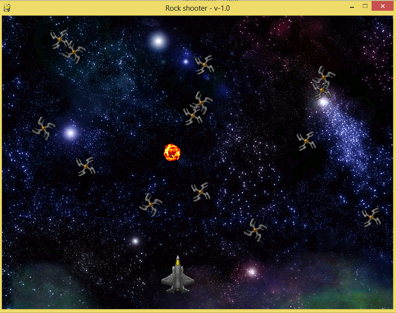

Rock Shooter
============

It's a simple 2D shoot game used to study the concepts of 2D games (sprites, animations, scrolling, collisions, etc).
The idea is integrate step by step theses and other concepts and have fun while learning them!

Screen shot preview:

Requirements
============

Python and pygame!

To run the game:
================

</pre></code>$ python rockshooter.py</pre></code>

or

</pre></code>$ ./rockshooter.py</pre></code>